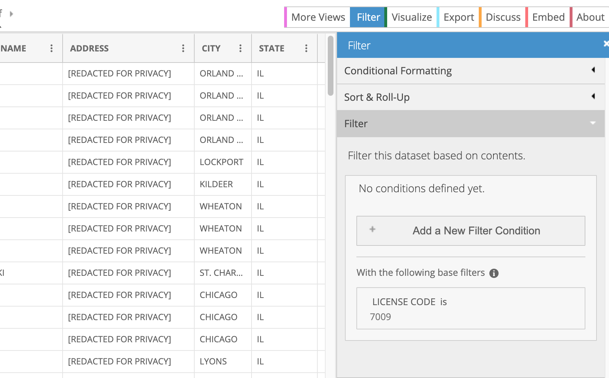

# More command-line hackery with the Chicago business data

<!--ts-->
   * [More command-line hackery with the Chicago business data](biz-extra.md#more-command-line-hackery-with-the-chicago-business-data)
      * [Intro](biz-extra.md#intro)
      * [Using ripgrep to do a little data cleaning](biz-extra.md#using-ripgrep-to-do-a-little-data-cleaning)
         * [grep oopsies!](biz-extra.md#grep-oopsies)
         * [Squeezing consecutive whitespace](biz-extra.md#squeezing-consecutive-whitespace)
            * [Header cleanup](biz-extra.md#header-cleanup)
      * [Extra fun](biz-extra.md#extra-fun)
         * [Pharma reps](biz-extra.md#pharma-reps)
         * [Grocery stores and food desserts](biz-extra.md#grocery-stores-and-food-desserts)
         * [Business owners](biz-extra.md#business-owners)
         * [Joining](biz-extra.md#joining)

<!-- Added by: dan, at: Wed Jul 22 23:33:05 CDT 2020 -->

<!--te-->

## Intro

Lorem ipsum dolor sit amet, consectetur adipisicing elit. Quidem amet recusandae totam, id quas, consequuntur optio consequatur obcaecati harum, aperiam vero, officia! Reiciendis, expedita earum nulla vitae accusantium eos! Qui.


## Using ripgrep to do a little data cleaning

- Change all dates from the U.S. format of MM/DD/YYYY to the superior [ISO8601 standard](https://en.wikipedia.org/wiki/ISO_8601) of YYYY-MM-DD
- Squeeze consecutive whitespace, e.g. `SHAKE  SHACK` to `SHAKE SHACK`


### grep oopsies!

LOREMIPSUM TK

```sh
cat raw_licenses.csv \
   | rg '(\d{2})/(\d{2})/(\d{4})' -r '$3-$1-$2' \
   > licenses.csv
```


Whenever wrangling, especially in an environment as fast and loose as the command line, you should always do a sanity check between the raw and the wrangled data. For example, do a line-count check to make sure all the data is in `licenses.csv`:

```sh
$ wc -l licenses.csv raw_licenses.csv
```

```sh
 1008245 licenses.csv
 1008246 raw_licenses.csv
 2016491 total
```

Doing `head licenses.csv` will show that it is missing the **header row**. Why did that happen? Because when we used `rg` to find/replace all the date patterns, `rg` – by design – does *not* output any lines that don't match the pattern. 

Luckily for us, every other line in the data has at least one data, though many other real-world datasets are not this predictable...

The easy fix for this is to use `head` to send the first line of `raw_licenses.csv` into `licenses.csv`. And then do our calls to `rg` as before, except **append** to `licenses.csv`:


### Squeezing consecutive whitespace

Some fields have extra whitespace, which is annoying:

```
Lorem ipsum dolor sit amet, consectetur adipisicing elit. Quidem reiciendis beatae illo, libero animi quo, incidunt modi blanditiis sequi non natus commodi soluta possimus impedit officia totam distinctio cupiditate repellendus?
```


This seems like it should work:

```sh
$ cat raw_licenses.csv \
   | rg ' +' -r ' ' > licenses.csv
```

But double-check to make sure that `rg` is returning every line in raw_licenses.csv (e.g. )

```sh
$ cat raw_licenses.csv \
   | rg ' +' -r ' ' | wc -l
```


```sh
$ head -n 1 raw_licenses.csv > licenses.csv
$ cat raw_licenses.csv \
   | rg '(\d{2})/(\d{2})/(\d{4})' -r '$3-$1-$2' \
   | rg ' +' -r ' '  \
   >> licenses.csv
```

#### Header cleanup

Since we're mucking about with the header row independently, let's transform it so that all spaces are changed to an underscore character, and all letters are lowercased – this will make future data wrangling steps, especially in SQL, easier to type out:

```sh
$ head -n 1 raw_licenses.csv  \
    | rg ' +' -r '_' \
    | tr '[:upper:]' '[:lower:]' \
    > licenses.csv

cat raw_licenses.csv \
   | rg '(\d{2})/(\d{2})/(\d{4})' -r '$3-$1-$2' \
   | rg ' +' -r ' ' \
   >> licenses.csv
```

Sample of the wrangled data can be found here:

https://docs.google.com/spreadsheets/d/1U5_rDbDMZKLepB7IJKSrixzXN6Tuzdw-jt4jurML0o8/edit#gid=1822870229


## Extra fun

Lorem ipsum dolor sit amet, consectetur adipisicing elit. Quod dolorem, obcaecati incidunt aspernatur quia necessitatibus error earum numquam, magnam quibusdam! Omnis deleniti reiciendis debitis placeat odio, cumque commodi laborum possimus.

### Pharma reps

One of the cool things about Socrata data portals is that anyone can create an account, and then create new views/variations of an existing dataset. For example, someone has created a dataset titled [Business Licenses - Pharmaceutical Representative](https://data.cityofchicago.org/Community-Economic-Development/Business-Licenses-Pharmaceutical-Representative/92a6-zazw) based off of the main business license dataset. 

Here is the ostensible justification:

> Beginning July 1, 2017, pharmaceutical representatives who market or promote pharmaceuticals within the City of Chicago for more than fifteen calendar days per year are required to obtain a Pharmaceutical Representative License, under an ordinance passed by City Council in the fall of 2016.

That's a new tidbit of info for me...generally, what's interesting to someone else is probably something interesting. 

Anyway, this pharma rep dataset is a 3,700-row subset of the business licenses, and you can browse it in Socrata's viewer here:

https://data.cityofchicago.org/Community-Economic-Development/Business-Licenses-Pharmaceutical-Representative/92a6-zazw/data

A thing to note is that in these Socrata data subsets, you can usually see the filtering steps/conditions that was used to create the subset. In this case, the only filter condition seems to be: 

> LICENSE CODE is 7009

<a href="https://data.cityofchicago.org/Community-Economic-Development/Business-Licenses-Pharmaceutical-Representative/92a6-zazw/data
">
</a>

We don't need to download this subset – we can filter our `licenses.csv` data just as easy from the command line:

```sh
$ cat licenses.csv | xsv search '7009' -s 'license_code' > pharma-licenses.csv
```

Do a quick sanity check to see if we get the same row count as listed on the [pharma data subset page](https://data.cityofchicago.org/Community-Economic-Development/Business-Licenses-Pharmaceutical-Representative/92a6-zazw) (3,707):

```sh
$ wc -l pharma-licenses.csv 
3708
```

Yep!

### Grocery stores and food desserts

Apparently in 2011 and 2013, the city of Chicago attempted to study and calculate "the estimates of Chicagoans living in food deserts". The list of grocery stores they used are on Socrata, but we can also find it on Github:

https://github.com/Chicago/food-deserts

The lists of grocery stores for the two years studied:

- 2011 (492 rows): https://github.com/Chicago/food-deserts/blob/master/data/Grocery_Stores_-_2011.csv
- 2013 (507 rows): https://github.com/Chicago/food-deserts/blob/master/data/Grocery_Stores_-_2013.csv

Anyway, I thought it might be fun to repeat this study for 2020

> **Narrator:** it was not, in fact, fun

Basically, there's no clear-cut way in the business license data to tell if a given business is a "grocery store". Here's an example of how you'd find that out for yourself, by filtering a few known grocery stores and non-grocery stores and comparing what their license records look like:

```sh
$ cat licenses.csv \
    | xsv search -i 'TRADER JOE|\bALDI\b|DEVON MARKET|DUNKIN DONUT' > sample.grocers.csv
```

A natural assumption might be: any business with a `license_description` of `'Retail Food Establishment'` and a `business_activity` of `Retail Sales of Perishable Foods` is a "grocery store"...but, that applies for both Dunkin Donut locations and Trader Joe's and Aldi.

In other words, I have no idea how the [Chicago study](https://github.com/Chicago/food-deserts) created their 2011 and 2013 lists, but I assume some manual work was involved.

I have an idea of cross-referencing another city dataset – [Restaurant and Food Service Inspection Reports](https://www.chicago.gov/city/en/depts/cdph/provdrs/healthy_restaurants/svcs/restaurant_food_inspection.html) – but that's complicated enough for its own walkthrough...


### Business owners

https://data.cityofchicago.org/Community-Economic-Development/Business-Owners/ezma-pppn

The description reads as thus:

> This dataset contains the owner information for all the accounts listed in the Business License Dataset, and is sorted by Account Number. To identify the owner of a business, you will need the account number or legal name, which may be obtained from theBusiness Licenses dataset: https://data.cityofchicago.org/dataset/Business-Licenses/r5kz-chrr. Data Owner: Business Affairs & Consumer Protection. Time Period: 2002 to present. Frequency: Data is updated daily.


```sh
$ curl -Lo raw_owners.csv 'https://data.cityofchicago.org/api/views/ezma-pppn/rows.csv?accessType=DOWNLOAD'
```

We do similar but lighter wrangling than we did with `raw_licenses.csv` (there are no dates to reformat):


```sh
$ head -n 1 raw_owners.csv  \
    | rg ' +' -r '_' \
    | tr '[:upper:]' '[:lower:]' \
    > owners.csv

# unfortunately, we can't squeeze whitespace using rg, because not
# every record in the owners dataset has whitespace
# so we use sed instead (or gsed, for macos which comes with an old version of sed by default)
$ tail -n+2 raw_owners.csv \
   | sed -E 's/ +/ /g' \
   >> owners.csv
```

(explaining sed is outside the scope of this walkthrough for now, but just think of it as a classic tool that `rg -r` tries to emulate in its own way, but not replace)


Unlike `licenses.csv`, `owners.csv` is small and simple enough to fit into a Google Sheet, which I've published for your convenience:


### Joining 

Lorem ipsum dolor sit amet, consectetur adipisicing elit. Consequuntur nam deserunt iure recusandae expedita cumque blanditiis commodi quae perspiciatis, repudiandae, eos? Distinctio, officiis consequuntur magni est rem dolores nulla quae?


```sh
$ xsv join --left  \
  'account_number' licenses.csv \
  'account_number' owners.csv \
  > joined_licenses_owners.csv
```
